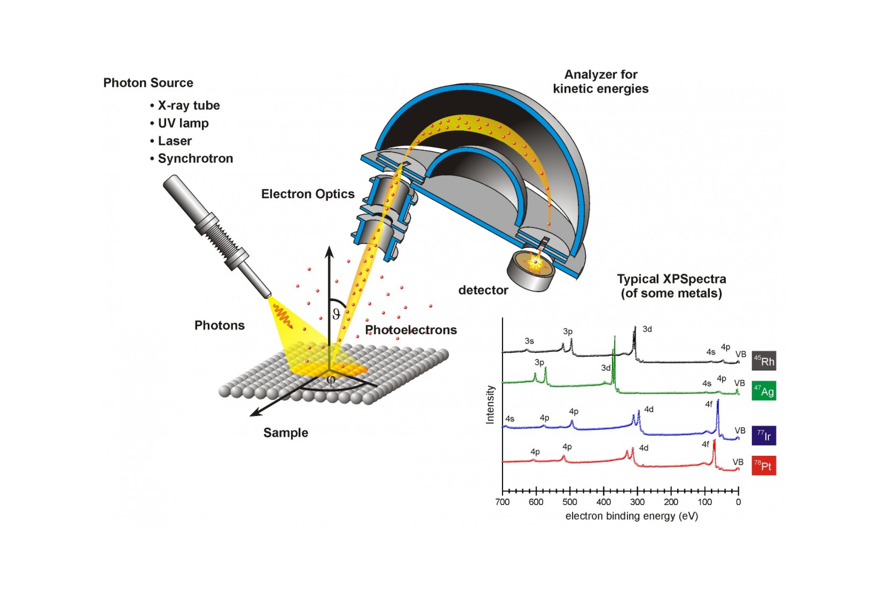
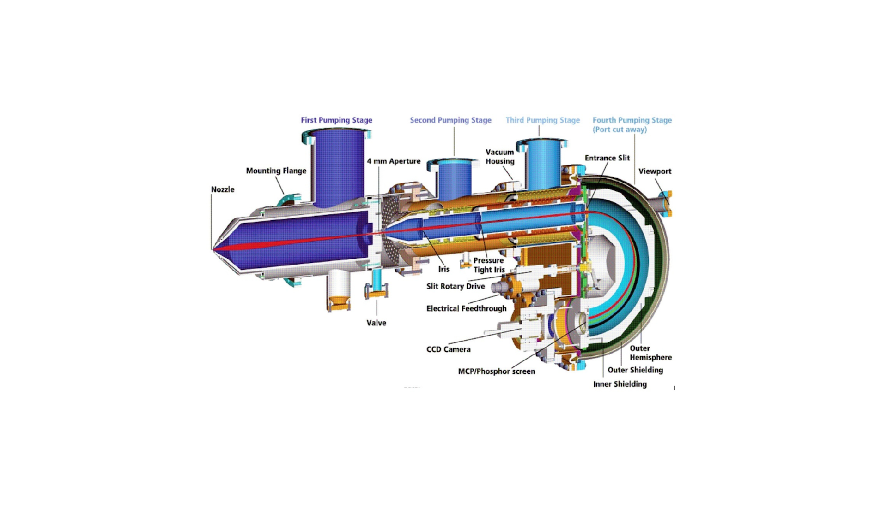
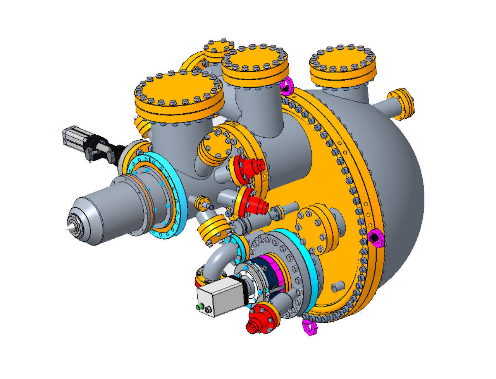
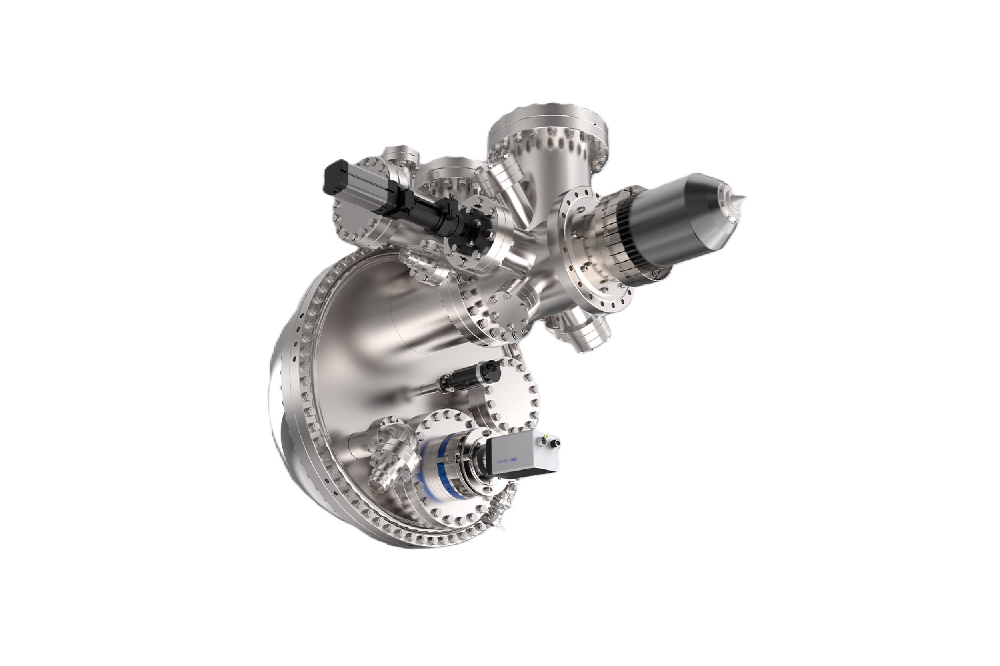

+++
title = "AEOLOS 150 AD-CMOS Electron Energy Analyzer"
draft = false
summary = " "

[cover]
  image = "cover.png"
  alt = "AEOLOS 150 AD-CMOS Electron Energy Analyzer"
  relative = true
+++

Designed and engineered precision components for the AEOLOS 150 AD-CMOS hemispherical energy analyzer, improving electron kinetic energy detection performance  

---

**Content based on public sources and employer-approved shareable information**

---

### System Overview
Hemispherical electron energy analyzers are widely used in surface science to measure the kinetic energy of electrons emitted under X-ray or electron excitation. The system uses a precisely controlled electrostatic field between concentric hemispheres to separate electrons by energy and direct them to an AD-CMOS detector, enabling high-resolution spectral analysis.

### Key Contributions & Engineering Milestones
While confidential details cannot be disclosed, my work focused on developing and refining critical components and subsystems to meet demanding performance requirements, including:
- EMI Mitigation: Designed Mu-metal shielding to minimize magnetic field interference and stabilize electron trajectories
- Optomechanical Design: Developed precision housings for electron optics with reliable alignment under thermal and vacuum loads
- Performance Improvement: Modified analyzer head components to enhance signal resolution and transmission efficiency
- UHV Integration: Designed housings, flanges, and interfaces to maintain ultra-high vacuum integrity
- Electrical Design: Developed high-voltage connections and low-outgassing internal wiring for sensitive instrumentation
- Vacuum System Design: Integrated turbo pump interfaces to improve pumping efficiency and vibration isolation
- DfM Support: Designed jigs and fixtures for repeatable assembly and precise alignment
- System Customization: Adapted the analyzer architecture for specialized experimental requirements

### System Views:

### Project Outcome
The AEOLOS 150 AD-CMOS was successfully delivered as a compact, high-performance analyzer with exceptional adaptability across diverse experimental setups. The project demanded precise engineering and close interdisciplinary collaboration to turn complex electron optics requirements into a reliable mechanical solution.
