+++
title = "EnviroESCA Electron Spectrometer"
draft = false
summary = " "

[cover]
  image = "cover.png"
  alt = "EnviroESCA Electron Spectrometer"
  relative = true
+++
 
Engineered a structural reinforcement for the EnviroESCA system to eliminate recurring metal bellows failures caused by pressure-induced buckling during multi-axis stage movement, improving instrument reliability and reducing maintenance downtime

--- 

**Content based on public sources and employer-approved shareable information**

---

### System Overview
The EnviroESCA is an electron spectrometer designed for chemical analysis under environmental conditions. A key element of the sample stage is the metal bellows, which enables multi-axis motion while maintaining vacuum isolation from the surrounding atmosphere.

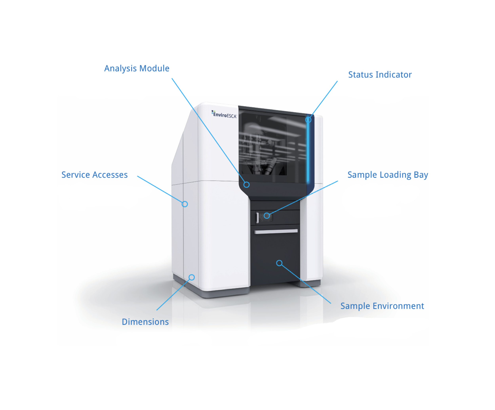

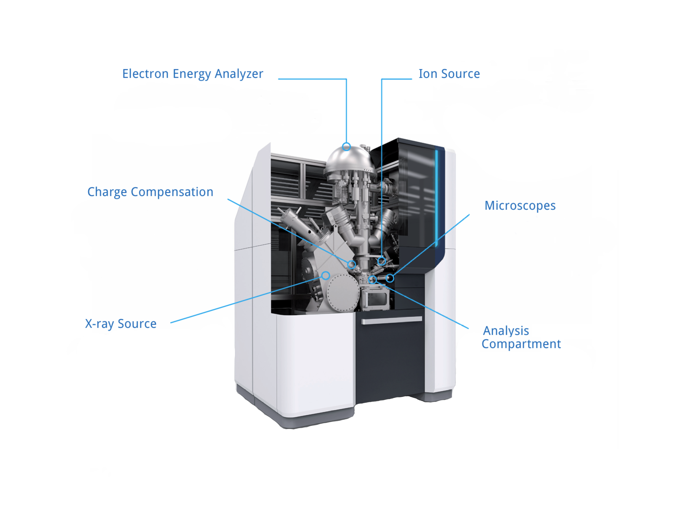

### Sample Environment Module
The metal bellows is part of the movable stage system within the sample environment module.

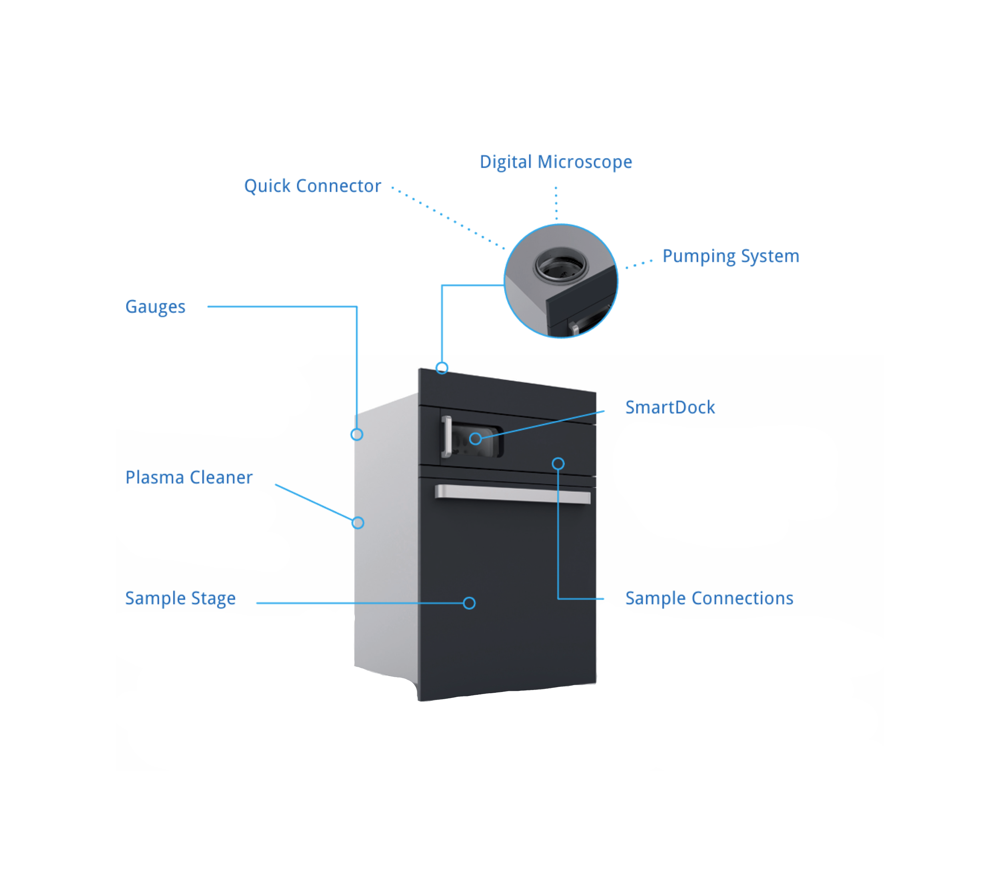

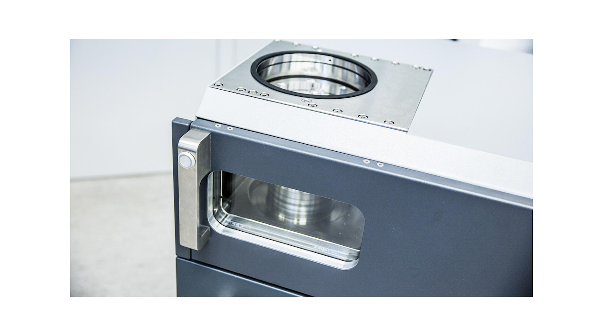

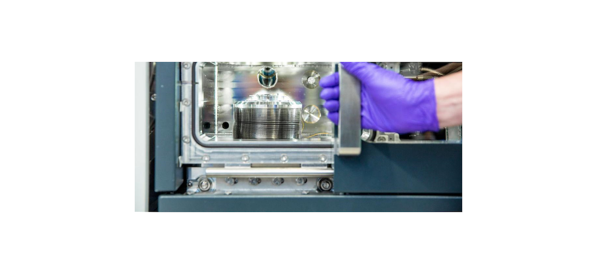

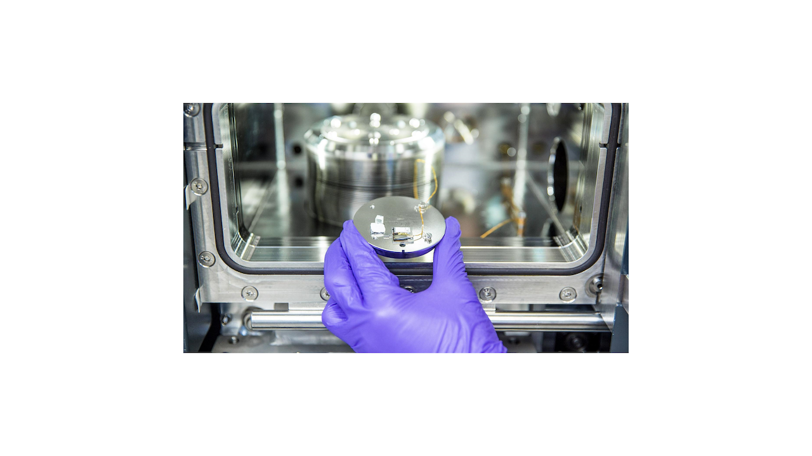

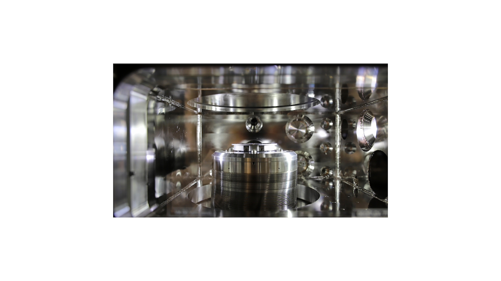

### Problem Statement
A critical failure mode was identified in the metal bellows: it experienced plastic deformation and buckling, eventually leading to rupture and loss of the hermetic seal. These failures occurred prematurely, well before the component’s rated cycle life.

Key Operating Conditions: 
- High pressure differentials acting across the bellows walls during operation
- Full Z-axis extension occurring simultaneously with significant X/Y displacement

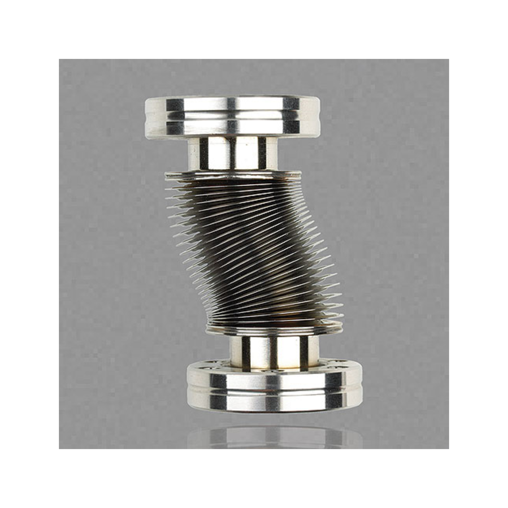

### System Configuration (Pre-Modification):
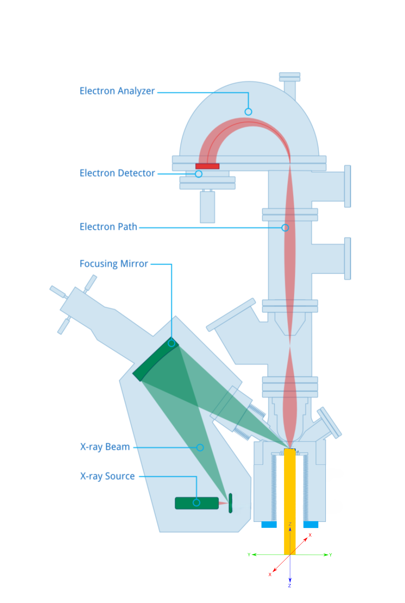

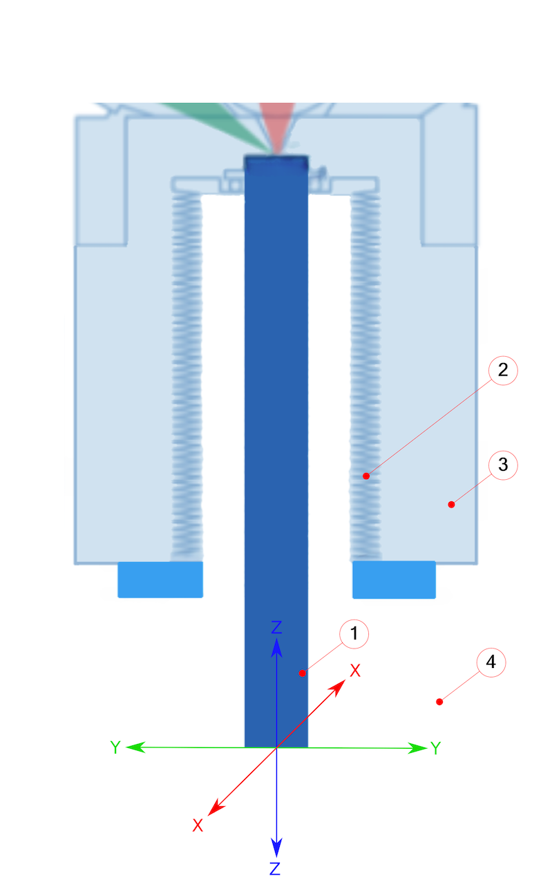

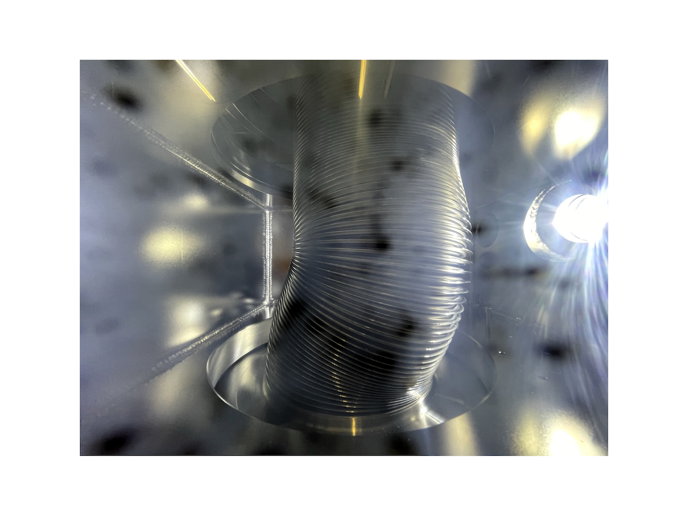

### Root Cause Analysis
The failure was driven by high differential pressure across the bellows membrane, amplified during extreme travel conditions. This pushed the bellows into a critical stress state, causing buckling and accelerating fatigue until the hermetic seal eventually ruptured.

The diagram above illustrates the system configuration before the solution was implemented:
- 1 - Movable Stage: Undergoes Z-axis and X/Y motion
- 2 - Metal Bellows: Serves as the primary vacuum barrier and was the main failure point
- 3 - Ultra-High Vacuum (UHV): Internal environment maintained at 0.000000001 mbar
- 4 - Atmospheric Pressure: External environment at approximately 1000 mbar

### Proposed Solution: Specialized Sealing Mechanism
To eliminate bellows buckling, a specialized sealing mechanism was introduced to separate pressure loads from bellows deformation. The design uses dedicated sealing zones to allow multi-axis motion while maintaining vacuum integrity:
- Zone A (Lateral Compliance): A sealing interface (highlighted in yellow) that maintains a hermetic seal while allowing unrestricted X/Y translation
- Zone B (Axial Compliance): A dedicated sealing region that supports full Z-axis travel without transferring buckling loads to the bellows wall

### System Configuration (After Modification):
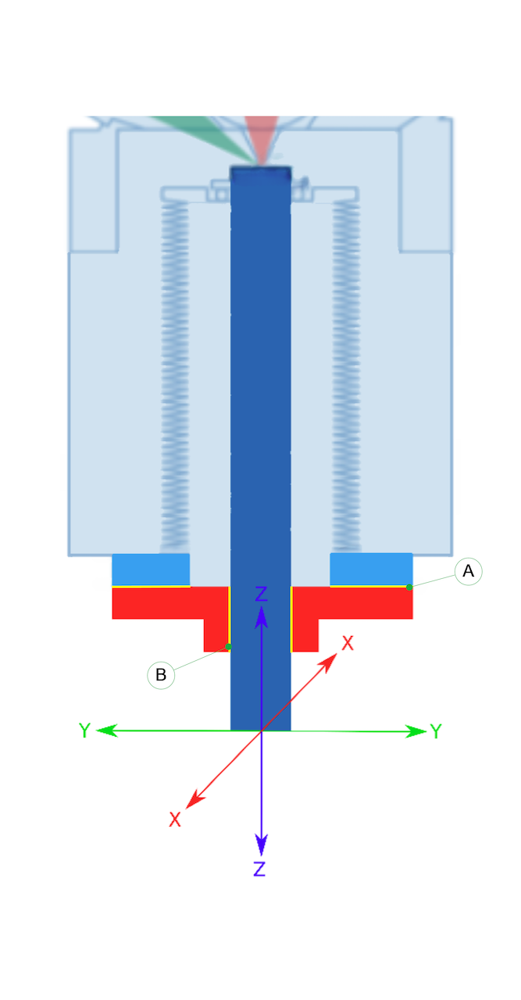

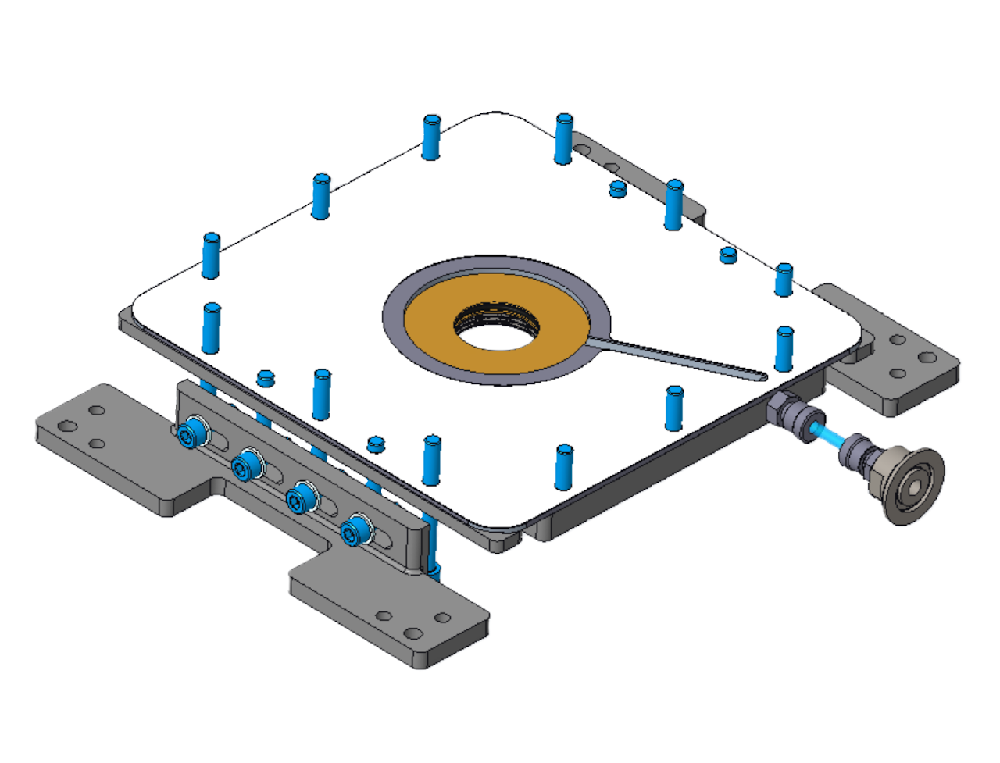

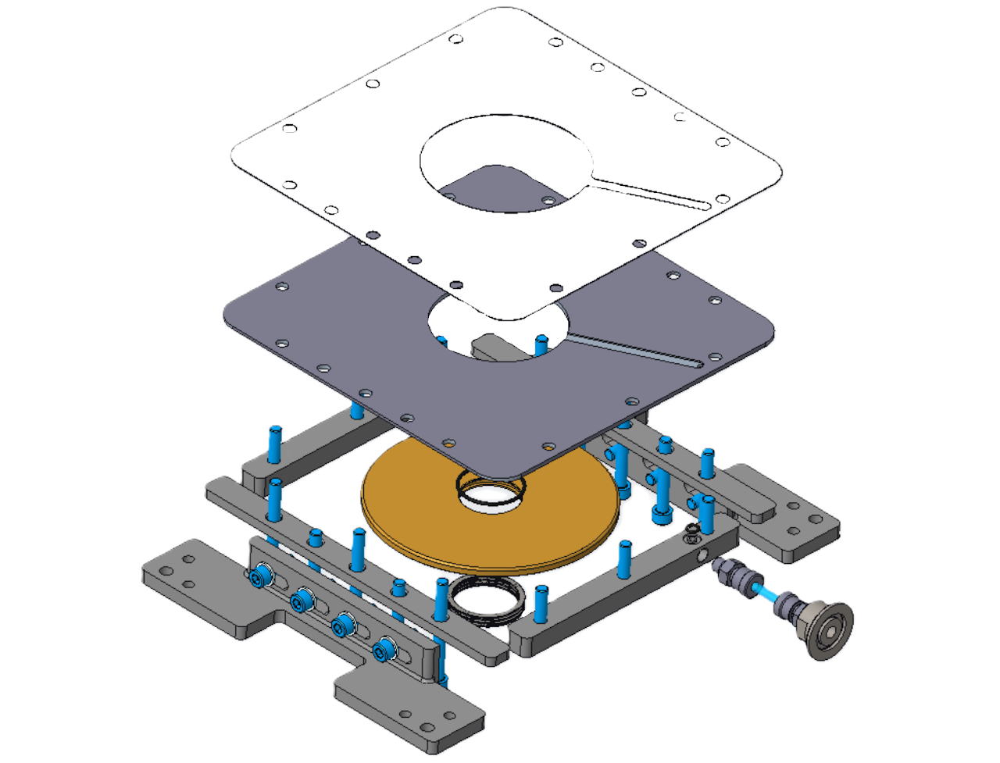

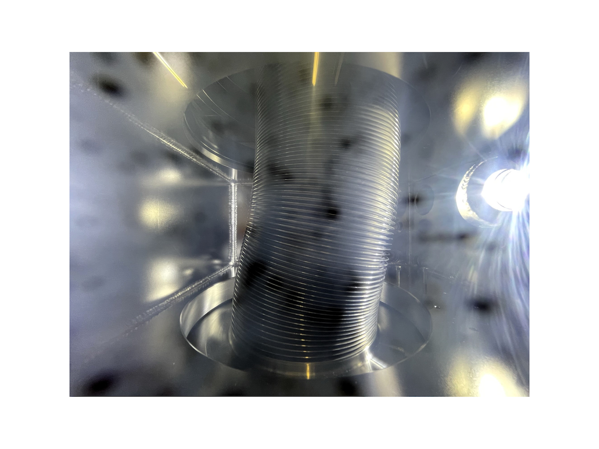

### Project Outcome
The modified EnviroESCA system was rigorously tested to confirm long-term reliability. Validation across the full 3D travel envelope showed no mechanical interference or loss of vacuum integrity, while accelerated life-cycle testing demonstrated a substantial increase in MTBF. The final design eliminated the bellows failure mode and improved reliability in high-vacuum operation.