+++
title = "EnviroMETROS Metrology System"
draft = false
weight = 4
summary = " "

[cover]
  image = "cover.png"
  alt = "EEnviroMETROS Metrology System"
  relative = true
+++
 
Designed and engineered high-performance subsystems and mechanical components for the EnviroMETROS series, enabling reliable automated surface analysis across research and industrial environments  

--- 

**Content based on public sources and employer-approved shareable information**

---

### System Overview
EnviroMETROS is an advanced metrology platform designed for the chemical characterization of ultra-thin films and 2D materials. It enables non-destructive, depth-resolved compositional analysis with high precision, reliability, and repeatability.

### Key Contributions & Engineering Milestones
As part of the development team, I engineered and optimized several core subsystems for the EnviroMETROS platform, with a focus on vacuum integrity, thermal stability, and automation:
- Analytical Integration: Led the mechanical development and integration of the AEOLOS 150 AD-CMOS electron spectrometer
- Automated Sample Transfer: Designed and validated a high-reliability robotic transfer system for moving samples between the load-lock and UHV analysis chambers, ensuring repeatable positioning
- Vacuum Infrastructure: Optimized the turbomolecular pumping stack to achieve and maintain stable HV/UHV conditions in the 0.000000001 mbar range
- Thermal Management: Developed an active water-cooling system to maintain thermal stability of sensitive analytical components during high-power operation
- Bake-out & Process Monitoring: Engineered UHV-compatible bake-out procedures and internal illumination systems to improve process visibility and environmental control

### Automated Sample Handling
Developing the automated transport system required solving several interdisciplinary challenges to ensure both operator safety and system reliability:
- Operator Safety & Compliance: Designed integrated safety interlocks and physical guarding to reduce pinch-point risk during high-speed automated operation
- Precision Alignment: Developed a self-leveling kinematic sample stage to maintain sub-micron planarity throughout the full range of motion
- Error-Proofing (Poka-Yoke): Implemented mechanical constraints and sensor-based validation to prevent incorrect sample loading or orientation, protecting both the sample and internal optics
- Vacuum Structural Integrity: Optimized the mechanical design to withstand repeated cycling between atmospheric pressure and UHV conditions without fatigue or loss of alignment precision

### Early Concepts
Initial concept work and architectural trade-off studies were used to evaluate system feasibility. Early design iterations focused on space requirements and core functionality.
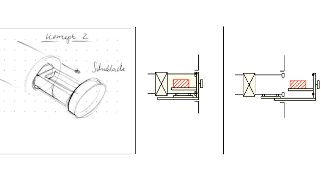

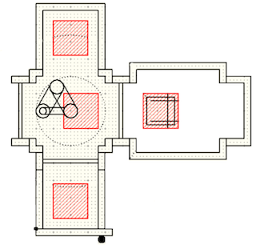

### Load Lock Mechanism & Sample Table:
Designed a precision-aligned load-lock to ensure repeatable sample handoff to the internal transport robotics under varying pressure conditions.
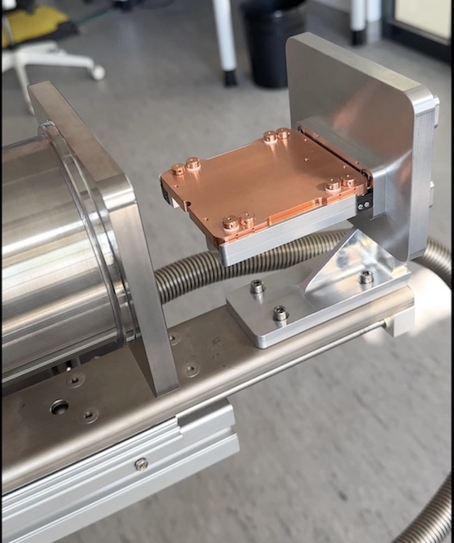

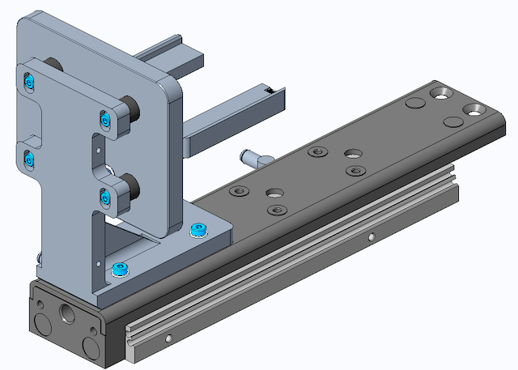

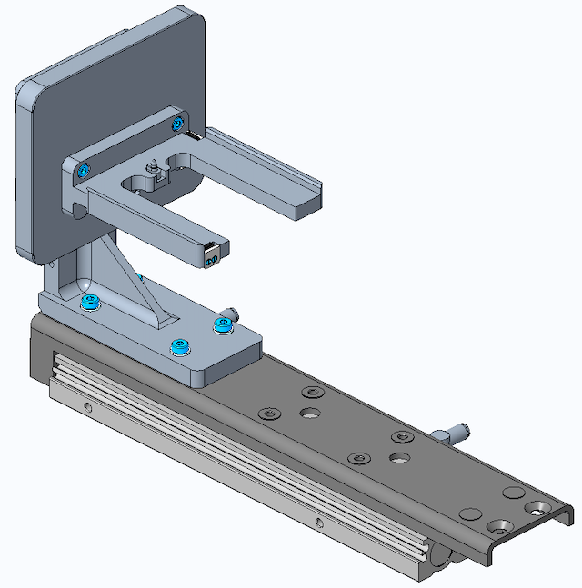

### Sample Table
Designed a high-stability kinematic mounting interface to maintain sub-micron repeatability and minimize thermal drift during long-duration chemical mapping.
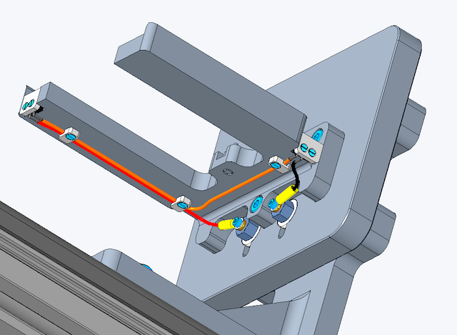

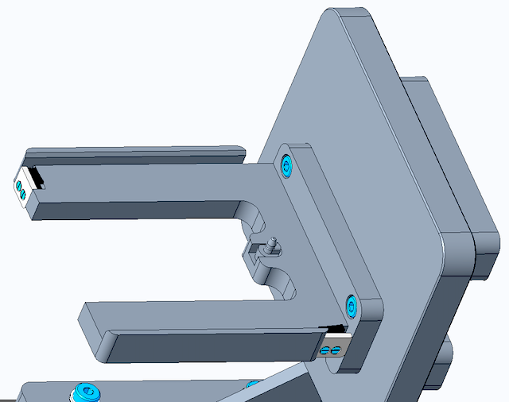

### Integrated Chamber Views
Developed a multi-port aluminum chamber with optimized line-of-sight access, eliminating interference between analytical sensors and automated robotics.

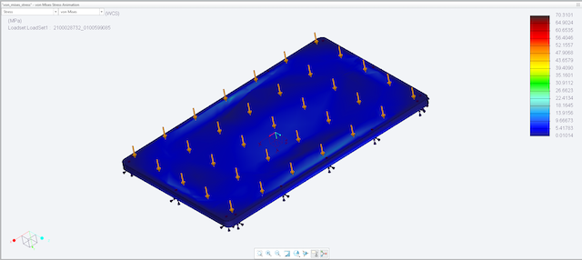

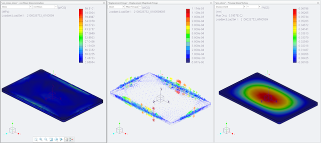

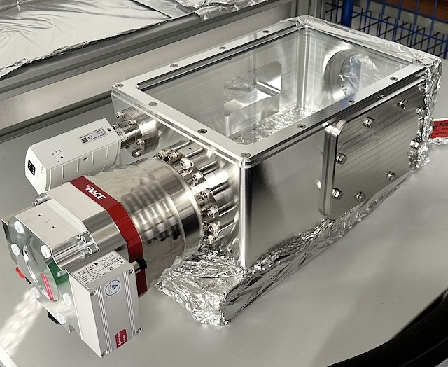

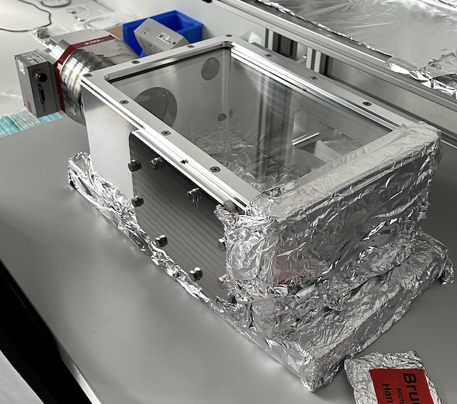

### Automated Sample Handling
Designed a multi-axis vacuum manipulator to deliver sub-millimeter handoff precision and ensure stable, repeatable sample placement on the analysis stage.
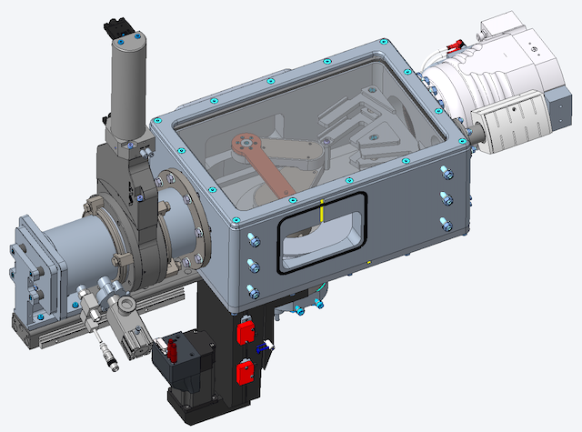

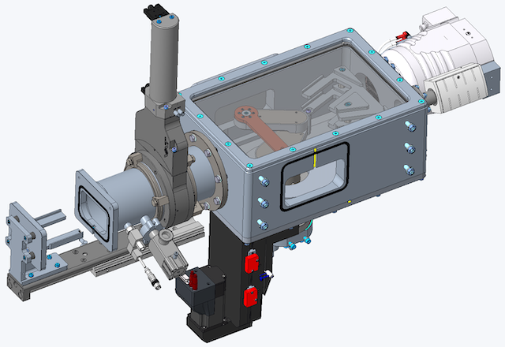

### Load Lock Mechanism in Action:
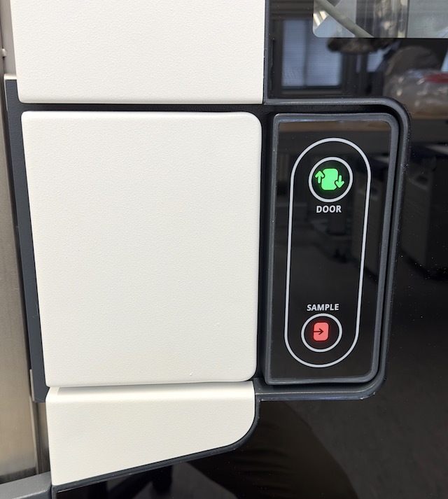

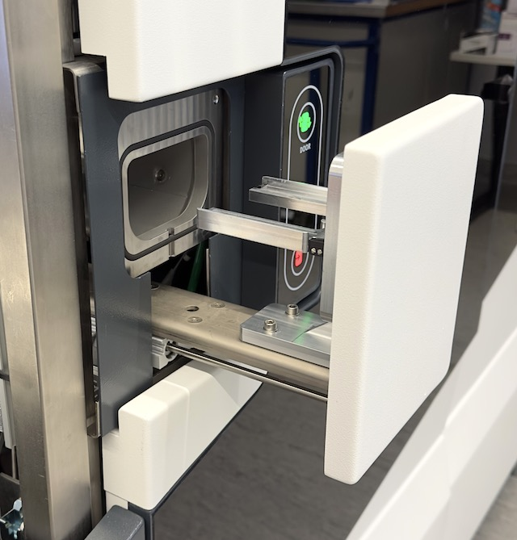

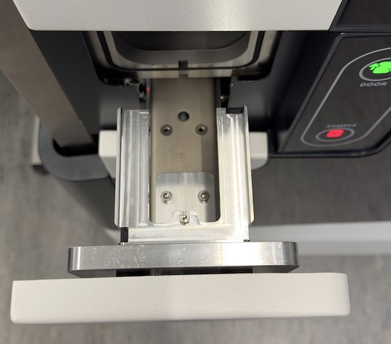

### TMP System Integration
Developed a collision-free vacuum layout that maintained safe clearances between high-speed rotating components and sensitive analytical hardware in all operating modes. Applied Design for Assembly (DFA) principles to create a modular pumping stack that improved field serviceability while preserving a compact system footprint.

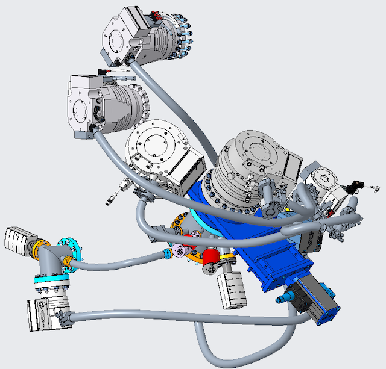

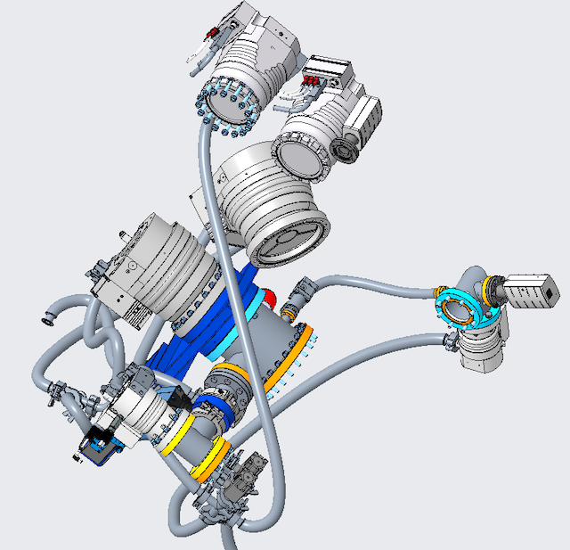

### Active Thermal Management
Designed a compact fluid-routing layout with integrated flow and temperature sensors to enable real-time diagnostics and fail-safe protection.

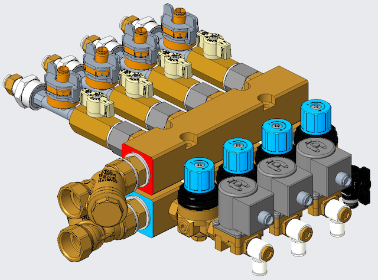
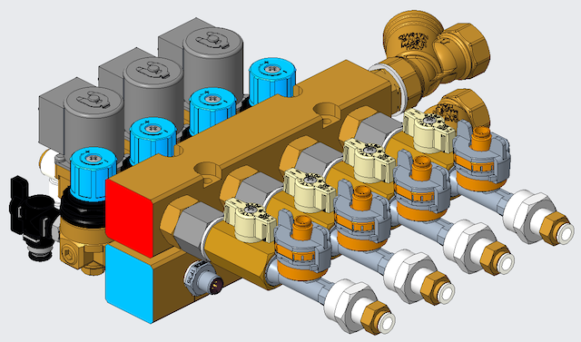
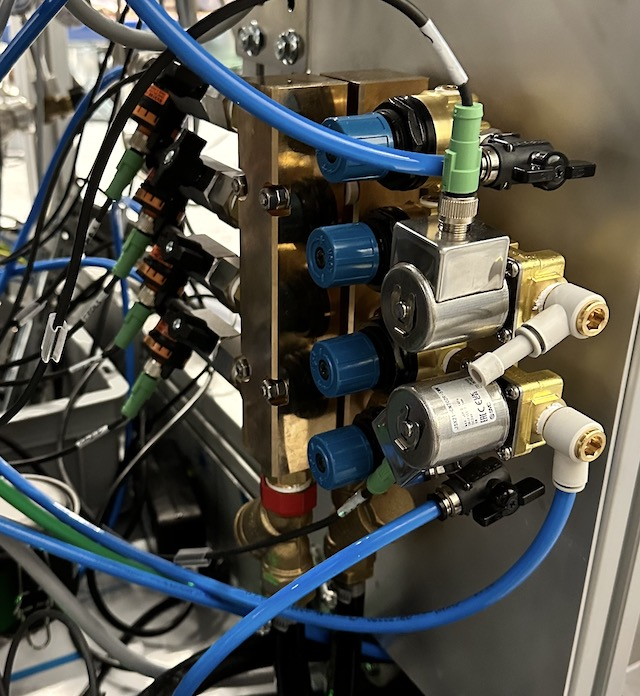
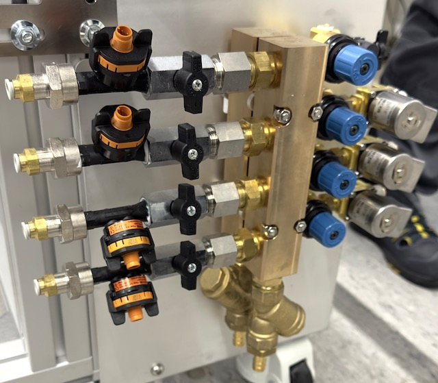

### Project Outcome
The EnviroMETROS platform was successfully developed and validated, meeting demanding performance, vacuum integrity, and industrial compliance requirements for both research and production environments.
- EnviroMETROS LAB: Deployed as a multi-technique analytical platform featuring a high-efficiency load-lock and precision automated sample handling, enabling fast, repeatable characterization of a wide range of materials for R&D
- EnviroMETROS FAB: Optimized for semiconductor manufacturing, this version supports fully automated handling of 200 mm and 300 mm wafers and is designed for seamless integration with standard Equipment Front End Modules (EFEM) and wafer-handling robotics