+++
title = "GS 16 Polymer Butt-Welding Machine"
draft = false
weight = 5
summary = " "

[cover]
  image = "cover.png"
  alt = "GS 16 Polymer Butt-Welding Machine"
  relative = true
+++
 
Developed a next-generation manual welding system for polymer piping, offering a practical middle ground between traditional manual tools and complex industrial automation

--- 

**Content based on public sources and employer-approved shareable information**

---

### Project Objectives
The GS 16 was developed around three core design goals:
- Integrated Precision Positioning: Developed a high-stiffness guide system to ensure accurate axial alignment and eliminate the joint-bead inconsistencies common in lower-tier machines
- Self-Contained Pressure Regulation: Integrated precise pressure control directly into the unit, removing the need for external gauges or secondary pressure equipment
- Streamlined Workflow: Simplified the mechanical sequence to reduce setup time, replacing complex clamping and fixing steps with a more intuitive work-holding interface

These improvements addressed common limitations in competing machines, including inconsistent positioning, reliance on external pressure equipment, and unnecessary setup complexity.

### Background
Butt-fusion welding is a critical thermal joining process that depends on precise axial alignment and controlled interfacial pressure. To create a true monolithic joint—where polymer chains from both ends interdiffuse and fuse—the system must minimize mechanical deflection throughout the heating and cooling phases.

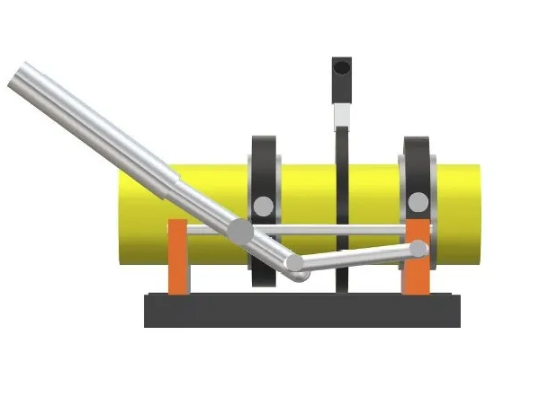

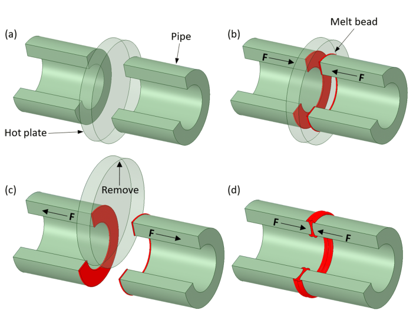

### Competitive Benchmarking
To identify opportunities for innovation, I analyzed leading manual butt-fusion machines on the market. Reviewing both technical specifications and user feedback revealed a consistent gap: the lack of integrated, precise pressure control.

### Market Leader

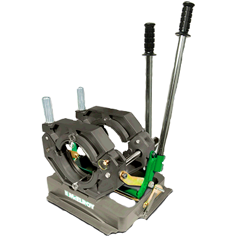

- Alignment Precision ✔️
- Integrated Pressure Control ❌
- Streamlined Workflow ✔️

### Industry Standard

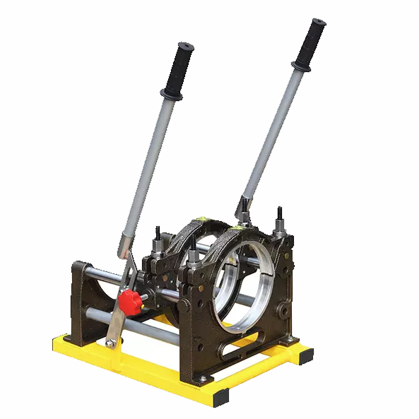

- Alignment Precision ❌
- Integrated Pressure Control ❌
- Streamlined Workflow ❌ 

### Value Option

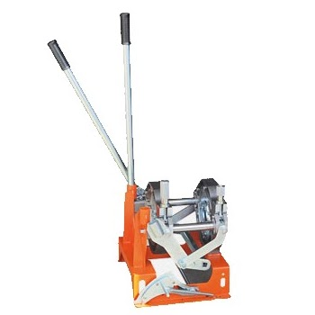

- Alignment Precision ✔️
- Integrated Pressure Control ❌
- Streamlined Workflow ❌

### Design Approach
Following iterative design cycles and functional prototyping, I engineered a combined locking and loading mechanism centered around a proprietary integrated brake system. This solution bridges the gap between manual handling and industrial-grade precision.

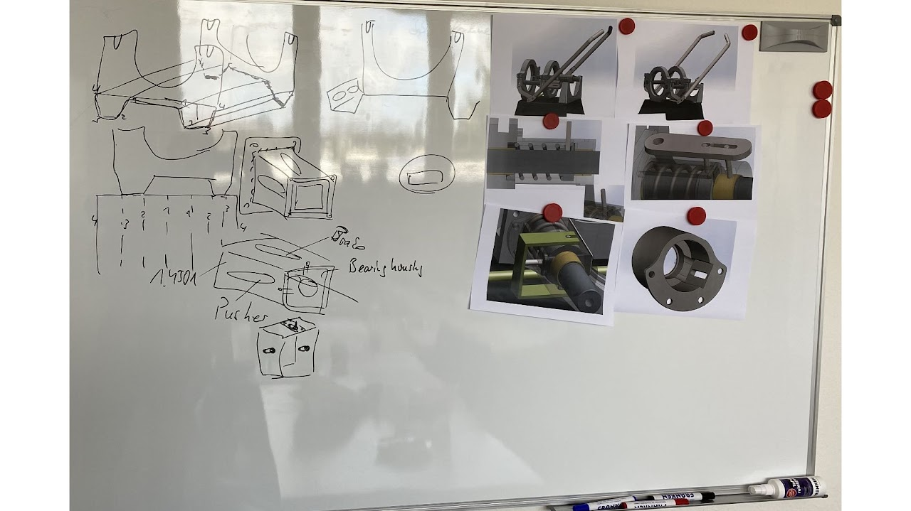

### System Architecture & Core Elements
The GS 16 is built on a modular architecture designed to maximize rigidity while maintaining a lightweight, portable form factor. Each core element was developed to address the key limitations identified during competitive benchmarking:
1) Concentric Clamping Interfaces: Precision-machined rings that ensure accurate axial alignment and uniform clamping across a range of polymer pipe diameters
2) Integrated Locking & Loading Module: A proprietary mechanism that secures pipe position and supports the transition from alignment to the pressurized fusion phase  
3) Ergonomic Lever Actuation: A high-leverage control system that gives the operator precise pressure control with minimal physical effort 
4) Torsion-Resistant Frame: A high-stiffness structural chassis designed to eliminate mechanical deflection and maintain joint integrity during cooling

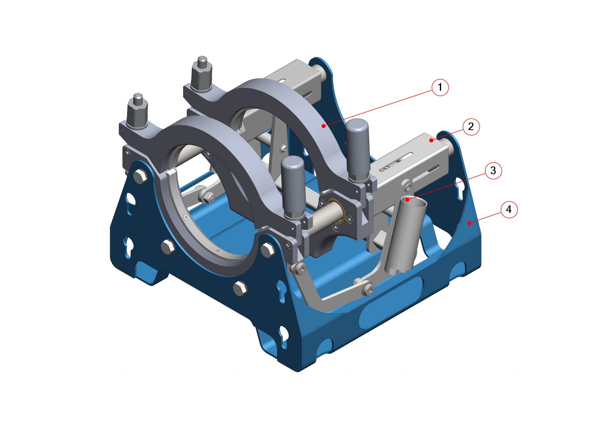

### The Locking & Loading Mechanism
At the core of the GS 16 is a proprietary locking and loading module designed to deliver repeatable welding pressure while maintaining precise axial alignment throughout the process:
1) Calibrated Loading Spring: Stores and applies consistent force to maintain the required interfacial pressure during the cooling cycle 
2) Integrated High-Friction Brake: A proprietary mechanism that enables instant position locking and fine control of welding force 
3) Reinforced Structural Housing: A high-strength enclosure that protects internal components from field debris while providing a rigid mounting point for the lever system
4) Case-Hardened Precision Guide Rod: Ground and hardened for smooth, low-friction travel and long-term resistance to mechanical wear

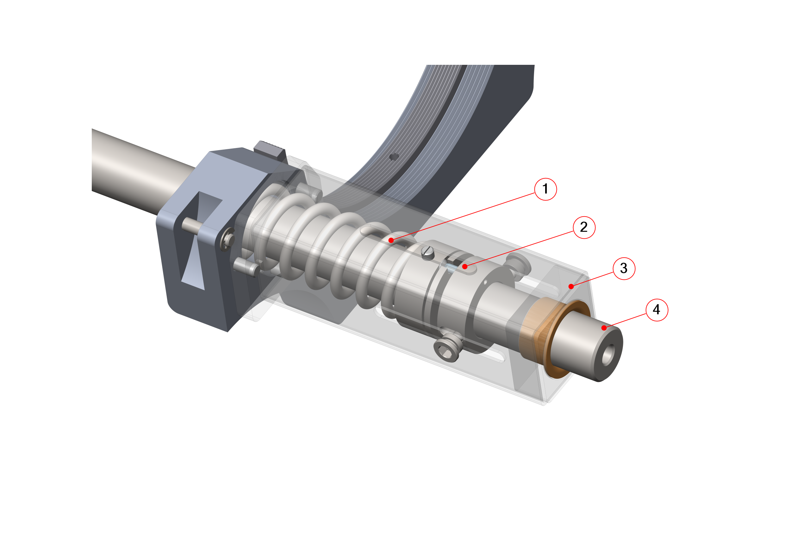

### The Innovative Brake
The core of the GS 16 is its multi-stage braking mechanism. This assembly uses a combination of active and passive interfaces to convert rotational screw input into linear clamping force, giving the operator precise control over the polymer fusion process:
1) Indicator Screw: Provides a visual reference for setting and repeating precise pressure levels
2) & 7. Active and Passive Rings: Form the primary friction interface, with the active ring moving axially to engage the passive ring
3) Anti-Backlash Screw: Eliminates mechanical play in the assembly to ensure immediate brake engagement
4) Primary Compression Screws: Deliver high clamping force during the initial locking phase
5) Wedging Ring: Uses a geometric wedging effect to multiply input force into high-integrity locking pressure
6) Incremental Lead (Crawling) Screws: Allow ultra-fine adjustment of interfacial pressure during the critical fusion and cooling stages

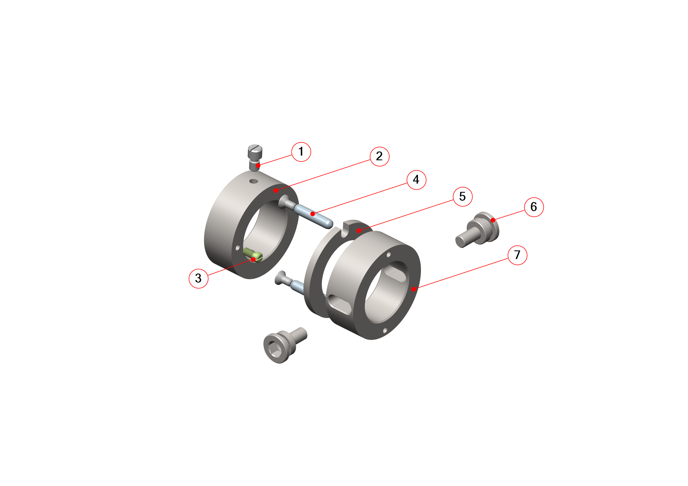

### Field Prototype Validation
During prototype validation, the polymer pipes were positioned in the concentric clamping rings, where the high-stiffness frame ensured immediate axial alignment without manual shimming or external supports. After heating, the operator used the ergonomic lever to compress the loading spring, and the innovative brake automatically locked the position at the calibrated pressure. Following cooling, the clamping rings were released for final inspection. The resulting double bead was uniform and monolithic, meeting the structural requirements for high-pressure fluid transport. 
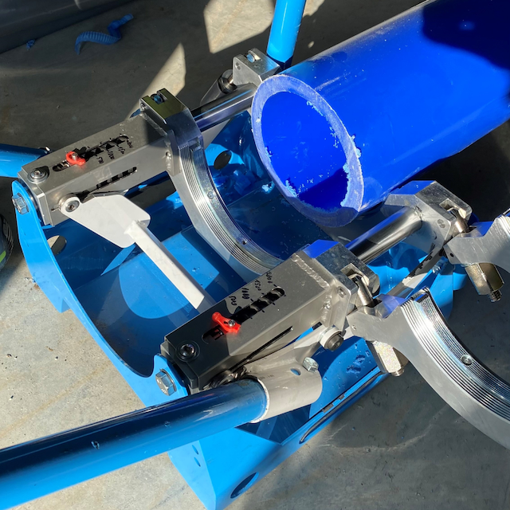
 
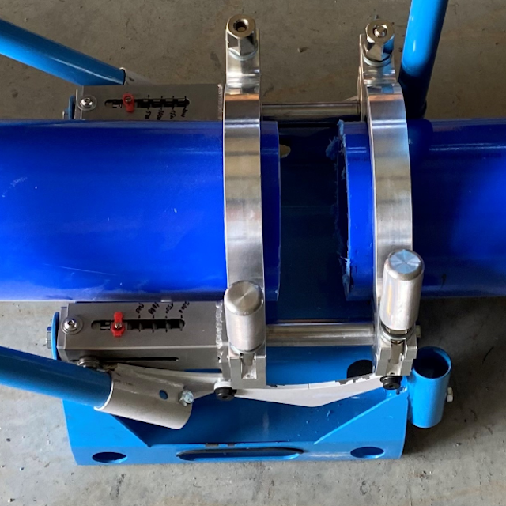

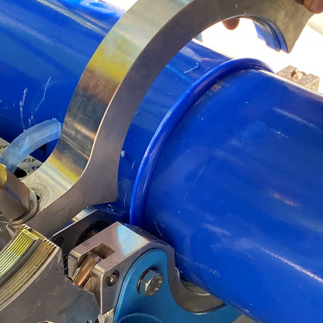

### Internal Mechanism
The GS 16 incorporates a mechanical power train that converts manual lever input into a constant, calibrated fusion force. It is designed to deliver high mechanical advantage while maintaining a fail-safe locking function on the applied pressure.

Load Application & Force Multiplication:

Lever input is transmitted through the crawling screws to the active and passive rings, compressing the loading spring to generate the required fusion pressure.

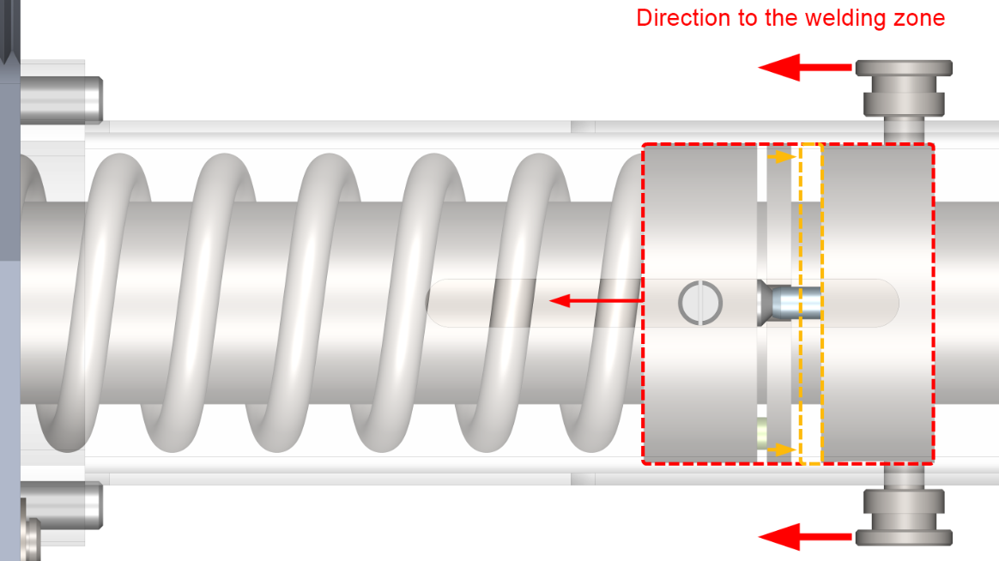

Pressure Retention & Visual Validation:

Once the indicator reaches the target pressure mark, the mechanism locks in the applied pressure through the wedging ring geometry and compensating slots.

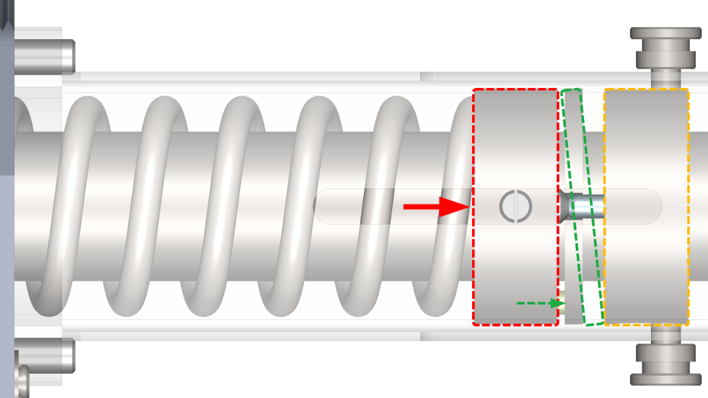

Controlled Load Release:

Reverse lever motion disengages the wedging ring and smoothly releases the spring load.

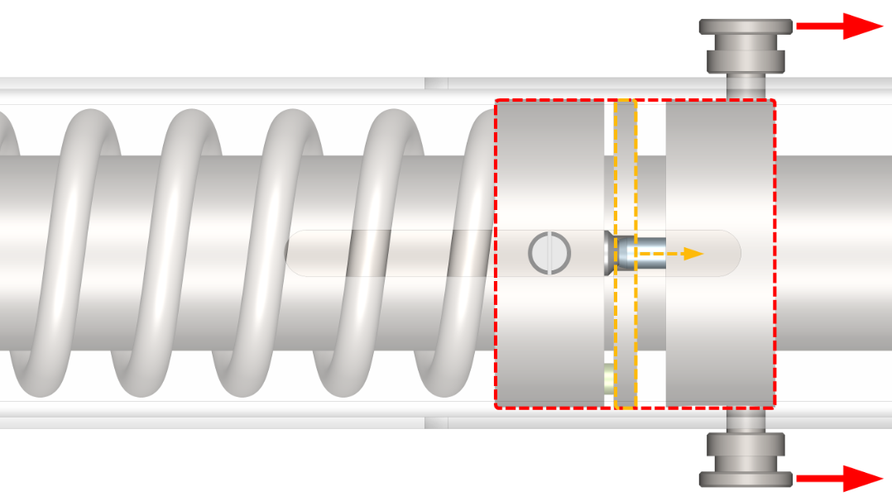

## Project Outcome
The GS 16 redefined the manual butt-fusion process by combining precise alignment and integrated pressure control in a single, intuitive platform. By addressing key shortcomings in competing machines, the final design delivered a stronger balance of weld quality, usability, and operational efficiency.

Key Performance Achievements:

- Precision: Achieved fully repeatable axial alignment through a high-stiffness frame design
- Integrated Control: Eliminated the need for external pressure equipment, reducing both setup time and total kit weight
- Workflow Efficiency: Validated a single-operator workflow that reduced complexity and lowered the risk of error during the critical fusion phase.

Field testing confirmed both usability and functional performance, and the prototype was showcased at AHR Expo 2022 in Las Vegas

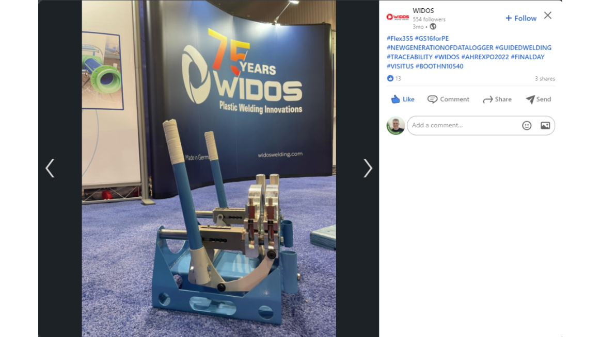
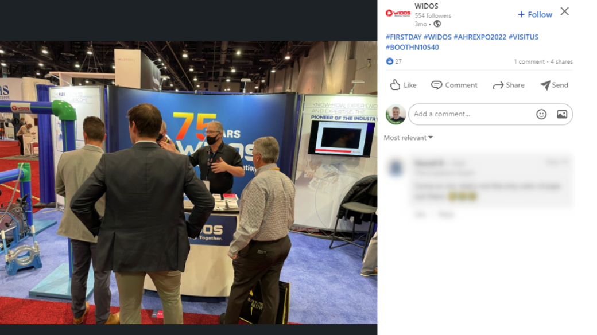
[Exhibition booklet (PDF)](booklet.pdf)

[← Back to Projects](/projects/)