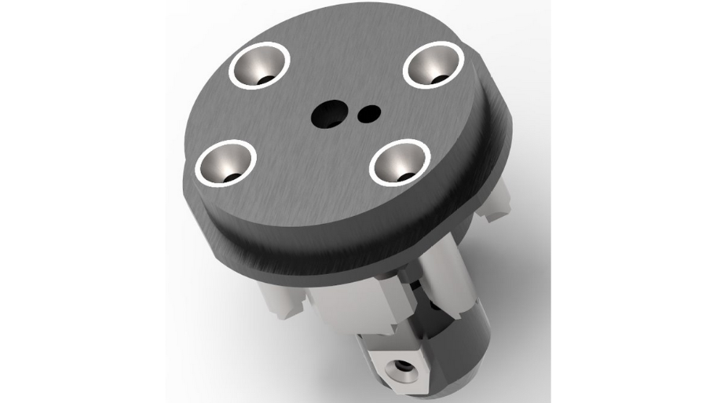
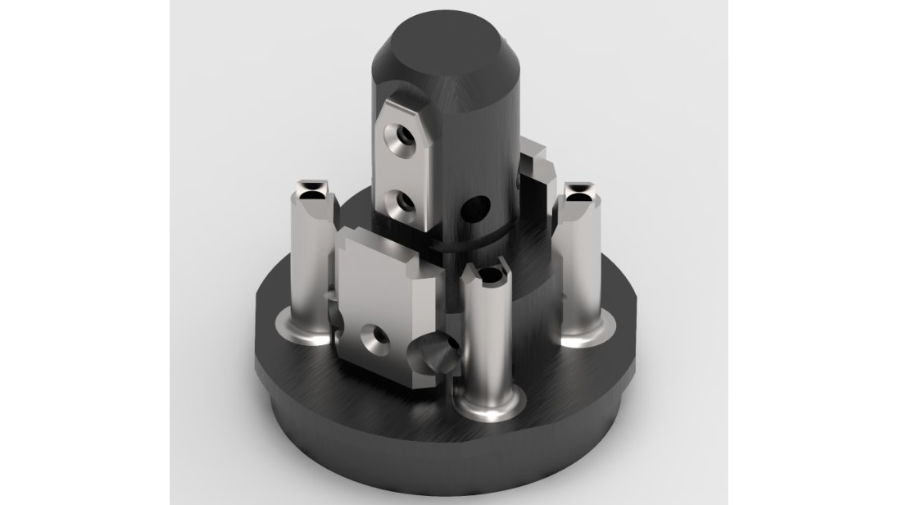
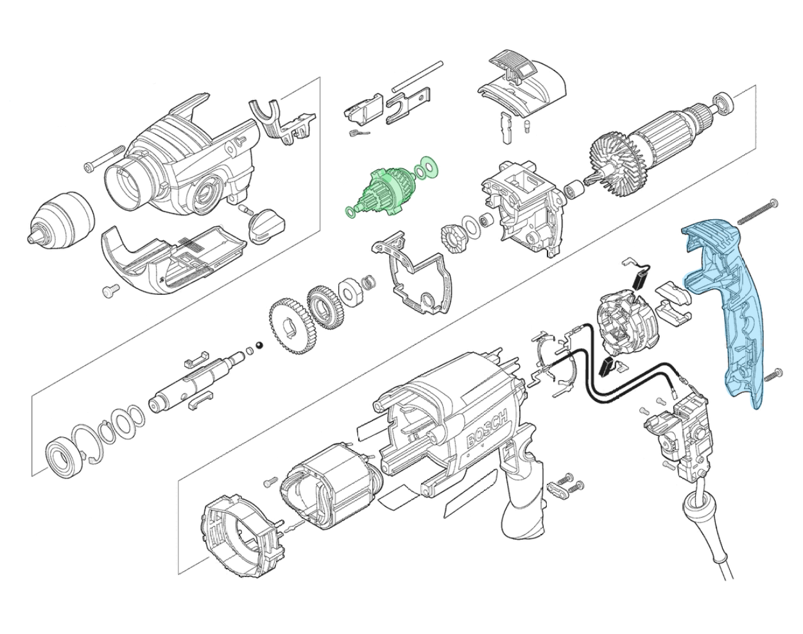
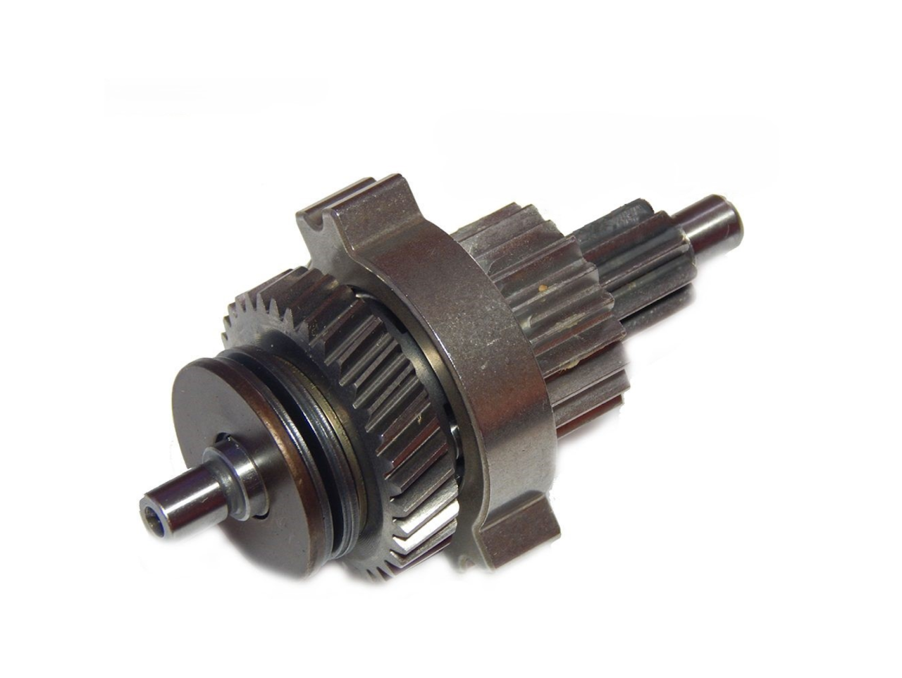
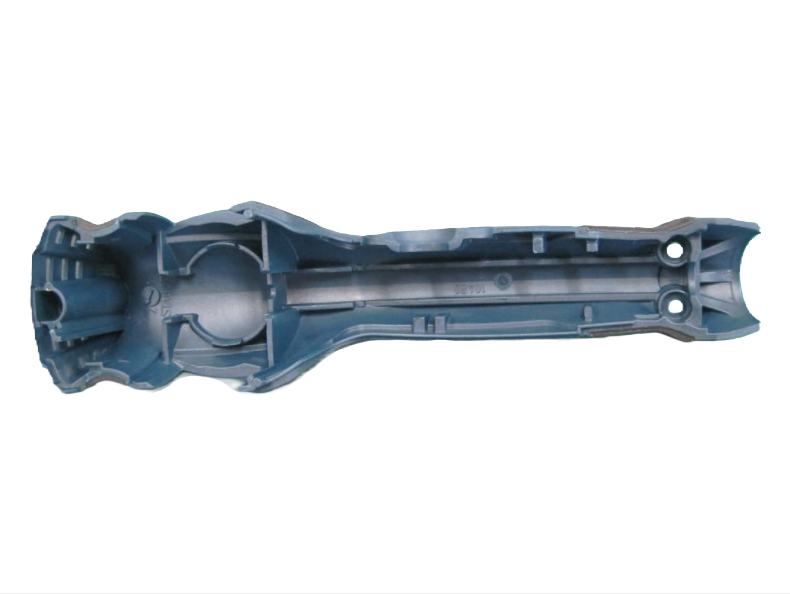

+++
title = "GSB 20-2 Impact Drill"
draft = false
weight = 6
summary = " "

[cover]
  image = "cover.png"
  alt = "GSB 20-2 Impact Drill"
  relative = true
+++
 
Led key mechanical and manufacturing updates for the GSB 20-2, building on the existing GSB 19-2 RE platform to improve safety, assembly efficiency, and transport robustness

--- 

**Content based on public sources and employer-approved shareable information**

---

### Project Goal
Bring the GSB 20-2 impact drill into production by upgrading components and accessories from the existing GSB 19-2 RE platform to improve safety, functionality, and market readiness.

### Overview
This implementation involved coordinated updates across product design, tooling, testing, and assembly. Key focus areas included:
- Integrating the kickback control safety system through housing updates and mold modifications
- Updating the transmission clutch to meet torque-limit safety requirements
- Improving assembly efficiency with a new production line jig
- Redesigning the carrying case retention system and validating performance through drop testing

### Key Contributions
- Kickback Control Integration: Revised the internal housing cover geometry, coordinated mold updates, and released the updated part for production
- Assembly Efficiency: Developed a new assembly jig that reduced stator assembly cycle time
- Transmission Clutch Update: Redesigned clutch components to meet torque-limit safety requirements through tolerance stack-up analysis
- Transport Robustness: Led drop testing to identify the safest tool position in the carrying case and implemented an elastic insert for improved protection during transport and handling
- Validation & Launch Support: Managed full verification cycles, including EMC / EMI, heating, accessory, and bench reliability/performance testing; reviewed results and supported corrective actions
- Production Readiness: Implemented and validated new assembly steps and supported operator training for production launch

### Supporting Evidence

### Production Assembly Jig

### Highlighted Modified Components

### Transmission Clutch Redesign

### Housing Cover Geometry for Kickback System Integration

### Product and Carrying Case

### Outcome
The project was delivered on schedule and enabled the successful launch of the GSB 20-2, with improved safety features, updated clutch performance, a redesigned carrying case, and enhanced assembly readiness.

[← Back to Projects](/projects/)