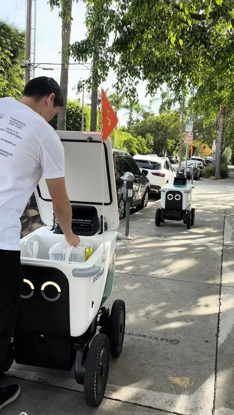

+++
title = "Serve Robotics Delivery Robot Platform"
draft = false
weight = 1
summary = " "

[cover]
  image = "cover.png"
  alt = " "
  relative = true
+++

**Senior Mechanical Engineer (Current Position)**

---

**Content based on public sources and employer-approved shareable information**

---

### Overview
At Serve Robotics, I contribute to the development of last-mile delivery robots built for real-world operation and fleet-scale reliability.

### Scope (High Level)
- Mechanical design and integration of robot subsystems, including structure, mechanisms, and packaging
- Design for manufacturability, assembly, and serviceability improvements
- Cross-functional collaboration with electrical, software, manufacturing, and supplier teams
- Test-driven iteration and reliability-focused design refinement

### Engineering Focus Areas
- Designing for reliability in outdoor environments, with attention to vibration, shock, wear, and ingress protection
- Improving service access to support fast and efficient maintenance
- Developing tolerance strategies for repeatable builds and consistent product performance
- Balancing cost and manufacturability with long-term durability

